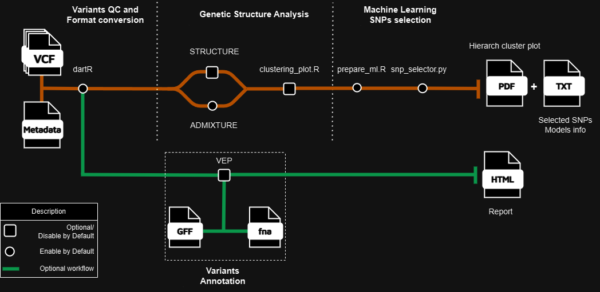

[](https://github.com/nf-core/hybrider/actions?query=workflow%3A%22nf-core+CI%22)
[](https://github.com/nf-core/hybrider/actions?query=workflow%3A%22nf-core+linting%22)<!--[](https://nf-co.re/hybrider/results)[](https://doi.org/10.5281/zenodo.XXXXXXX)-->

[](https://www.nextflow.io/)
[](https://www.docker.com/)
[](https://sylabs.io/docs/)
[](https://tower.nf/launch?pipeline=https://github.com/lfreitasl/hybrider)

# 

<!--[](https://nfcore.slack.com/channels/hybrider)[](https://twitter.com/nf_core)[](https://mstdn.science/@nf_core)[](https://www.youtube.com/c/nf-core) -->

## Introduction

**lfreitasl/hybrider** is a bioinformatics pipeline for population genetics analysis. Using VCF from RADseq experiments and associated metadata as inputs, this pipeline performs a set of analysis typically used in conservation genetics studies that involves one or more species using softwares such as STRUCTURE, Admixture, Treemix and custom Python and R scripts to describe genetic structuration of species/populations, identify hybridization patterns across the dataset and find signal SNPs for species identification.

<!-- TODO nf-core:
   Complete this sentence with a 2-3 sentence summary of what types of data the pipeline ingests, a brief overview of the
   major pipeline sections and the types of output it produces. You're giving an overview to someone new
   to nf-core here, in 15-20 seconds. For an example, see https://github.com/nf-core/rnaseq/blob/master/README.md#introduction
-->

<!-- TODO nf-core: Include a figure that guides the user through the major workflow steps. Many nf-core
     workflows use the "tube map" design for that. See https://nf-co.re/docs/contributing/design_guidelines#examples for examples.   -->
<!-- TODO nf-core: Fill in short bullet-pointed list of the default steps in the pipeline -->

1. Reads VCF, performs a series of filters and converts to specific formats for posterior analysis ([`dartR`](https://onlinelibrary.wiley.com/doi/10.1111/1755-0998.12745))
2. Performs STRUCTURE bayesian clustering ([`STRUCTURE`](https://web.stanford.edu/group/pritchardlab/structure.html), [`Structure_threader`](https://structure-threader.readthedocs.io/en/latest/))
3. Runs ADMIXTURE ([`ADMIXTURE`](https://dalexander.github.io/admixture/))
4. Optionally runs Treemix if metadata of population origin is provided ([`Treemix`](https://bitbucket.org/nygcresearch/treemix/wiki/Home))
5. When running with two putatively hybridizing species, it compares results of STRUCTURE and ADMIXTURE to label samples as hybrids and non-hybrids based on user defined ancestry coefficient threshold.
6. Runs supervised machine learning algorithms on labeled samples to identify signal SNPs that are highly associated with each species and hybrids, emiting various reports of models performance and information about important SNPs.
7. Additionally, if a fasta genome file and a GFF/GTF file of the reference genome used to assemble the reads/VCF is provided it can annotate the important SNPs using VEP. ([`VEP`](https://www.ensembl.org/info/docs/tools/vep/index.html))

## Pipeline summary
# 

## Usage

> [!NOTE]
> If you are new to Nextflow and nf-core, please refer to [this page](https://nf-co.re/docs/usage/installation) on how to set-up Nextflow. Make sure to [test your setup](https://nf-co.re/docs/usage/introduction#how-to-run-a-pipeline) with `-profile test` before running the workflow on actual data.

<!-- TODO nf-core: Describe the minimum required steps to execute the pipeline, e.g. how to prepare samplesheets.
     Explain what rows and columns represent. For instance (please edit as appropriate):
-->
First, prepare a samplesheet with your input data that looks as follows:

`samplesheet.csv`:

```csv
vcfs
path/to/my/file1.vcf
path/to/my/file2.vcf
```

Each row represents a vcf file with selected samples for the analysis, different VCF files can be used to test sensibility for different subsets of samples in the final results.

Also, you can add a csv formated file containing metadata for ALL individuals provided in the `samplesheet.csv` VCF files, this metadata file can have any number of columns since it has obligatory the `samples` column and optionally the `POP` column, it is very important that each row in the samples column have the exact same name in the VCF file:

`metadata.csv`:

```csv
samples,POP
IN1,river1
IN2,river1
IN3,river2
IN4,river2
```

> [!NOTE]
> If the metadata file has more individuals than the ones present in each (or both) VCF files, it will retrieve only the information of the ones present in VCFs.
>
> POP information will be used for plotting STRUCTURE and ADMIXTURE graphs.
>
> If you choose to run Treemix, POP information will be used to set the input file of this tool.
>
> Individuals with no population information (e.g. Captive animals) can be represented in the metadata under the same POP label for plotting purposes.
>
> I do not recommend you to include unknown POP information samples in Treemix analysis.


Now, you can run the pipeline using:

<!-- TODO nf-core: update the following command to include all required parameters for a minimal example -->

```bash
nextflow run nf-core/hybrider \
   -profile <docker/singularity/.../institute> \
   --input samplesheet.csv \
   --outdir <OUTDIR>
```

> [!WARNING]
> Please provide pipeline parameters via the CLI or Nextflow `-params-file` option. Custom config files including those provided by the `-c` Nextflow option can be used to provide any configuration _**except for parameters**_;
> see [docs](https://nf-co.re/usage/configuration#custom-configuration-files).

For more details and further functionality, please refer to the [usage documentation](https://github.com/lfreitasl/hybrider/blob/main/docs/usage.md) and the [parameter documentation](https://github.com/lfreitasl/hybrider/blob/main/docs/parameters.md).

## Pipeline output

To see the results of an example test run with a full size dataset refer to the [results](https://github.com/lfreitasl/hybrider/blob/main/results).
For more details about the output files and reports, please refer to the
[output documentation](https://github.com/lfreitasl/hybrider/blob/main/docs/output.md).

## Credits

lfreitasl/hybrider was originally written by [Lucas de Freitas](https://github.com/lfreitasl).


## Contributions and Support

If you would like to contribute to this pipeline, please see the [contributing guidelines](.github/CONTRIBUTING.md).

For further information or help, don't hesitate to get in touch.

## Citations

<!-- TODO nf-core: Add citation for pipeline after first release. Uncomment lines below and update Zenodo doi and badge at the top of this file. -->
<!-- If you use nf-core/hybrider for your analysis, please cite it using the following doi: [10.5281/zenodo.XXXXXX](https://doi.org/10.5281/zenodo.XXXXXX) -->

<!-- TODO nf-core: Add bibliography of tools and data used in your pipeline -->

An extensive list of references for the tools used by the pipeline can be found in the [`CITATIONS.md`](CITATIONS.md) file. Please cite the tools used in your hybrider run.

This pipeline uses code and infrastructure developed and maintained by the nf-core initative, and reused here under the [MIT license](https://github.com/nf-core/tools/blob/master/LICENSE).

> **The nf-core framework for community-curated bioinformatics pipelines.**
>
> Philip Ewels, Alexander Peltzer, Sven Fillinger, Harshil Patel, Johannes Alneberg, Andreas Wilm, Maxime Ulysse Garcia, Paolo Di Tommaso & Sven Nahnsen.
>
> _Nat Biotechnol._ 2020 Feb 13. doi: [10.1038/s41587-020-0439-x](https://dx.doi.org/10.1038/s41587-020-0439-x).
